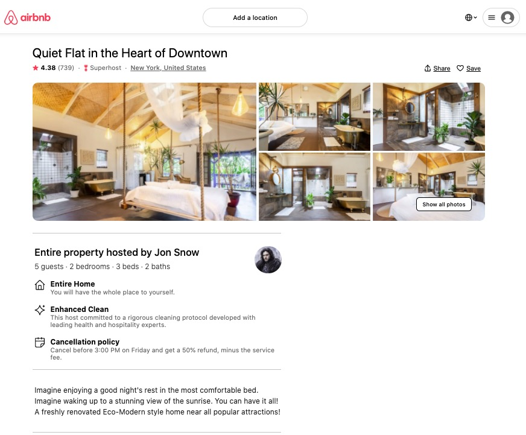
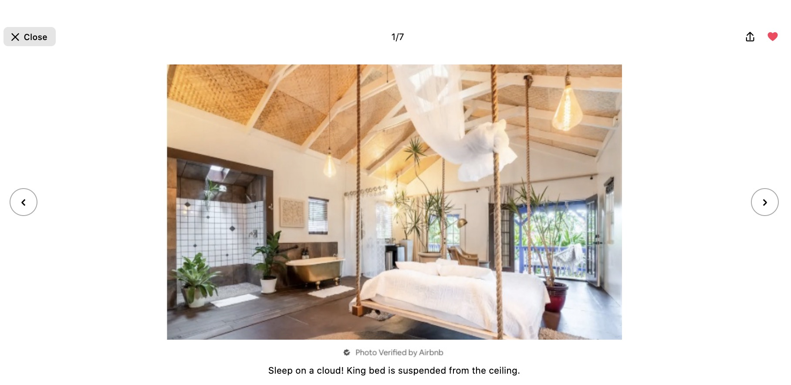

# propertygallery-service

A full stack Image Gallery component for an Airbnb clone rental page.

## Technologies
  * React 16.3.1
  * Styled-Components
  * MongoDB/Mongoose
  * Node.js
  * Jest
  * Enzyme
  * Webpack

## API

### Get Property Info
  * GET `property/:id`

**Path Parameters:**
  * `:id` property id

**Success Status Code:** `200`

**Returns:** JSON

```json
    {
      "_id": "Number",
      "name": "String",
      "rating": "Number",
      "totalratings": "Number",
      "superhost": "Boolean",
      "location": "String",
      "saved": "Boolean",
      "photos": [
        {
          "_id": "Number",
          "url": "String",
          "caption": "String",
          "verified": "Boolean",
        },
      ],
    }
```

## Images




